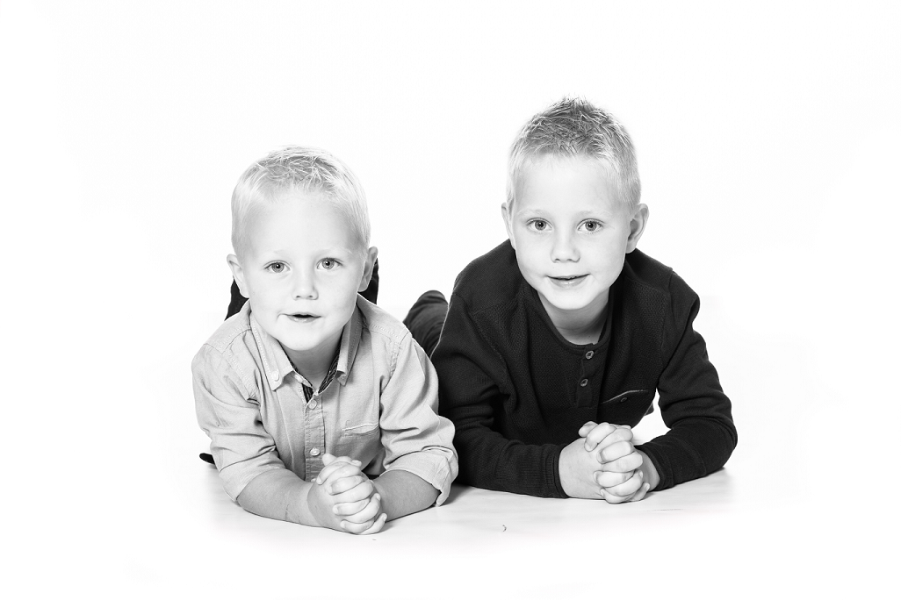

---
titleBreadcrumb: ME-sida
...

Marcus ME-sida i kursen *Design*
===============================

Hej och välkomna till min ME-sidan.

    
Här kommer lite kort information om mig, Marcus Holmersson. Jag föddes i slutet av 70-talet i ett litet samhälle strax utanför Kalmar. Efter gymnasiestudier och militärtjänstgörning läste jag till civilingenjör i Maskinteknik och tog examen från Linköpings Universitet 2005. Jag var redan på den tiden intresserad av programmering men då var det mest CNC- och PLC-programmering som gällde. Sedan dess har det tyvärr inte blivit så mycket programmering för egen del. Nu förtiden är det bara lite Visual Basic programmering för att utöka funktionaliteten i Excel.

    
Jag har som sagt de senaste 13 åren jobbat med produktionsteknik i alla dess former såsom projektledare, beredningsarbete, tillverkningsanalyser etc. och märker i mitt arbete ett ökat behov av att kunna mer programmering, dels för att bli en bättre beställare av denna typ av tjänster men även för att kunna göra en del mindre applikationer själv. Det är av dessa anledningar jag har hoppat på utbildningen i Webbprogrammering!

På denna sidan kan du bland annat hitta redovisningsmaterialet till de olika kursmomenten.

Sidan är skapad med [Anax Flat](https://dbwebb.se/anax/inledning/) som grund och är bassidan i dbwebb-kursen *design*.
